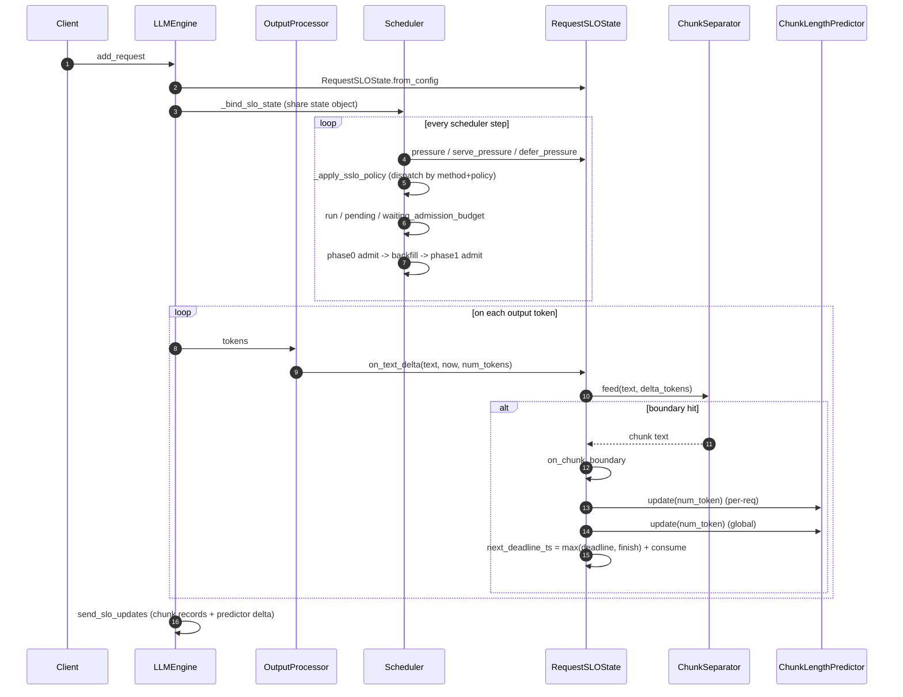
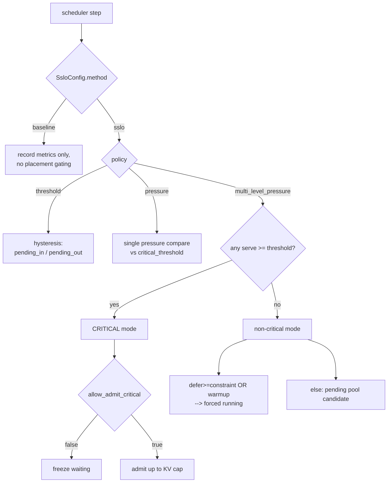

# SSLO — Sentence-level SLO Scheduling

SSLO models each LLM request as a stream of **sentence-** or **paragraph-level
chunks**, assigns a deadline to every chunk, and uses the per-chunk *pressure*
(remaining work ÷ time-to-deadline) to drive the vLLM scheduler's admit /
pending / waiting-freeze decisions.

The hypothesis: a TTS engine or human reader consumes the generated text
chunk-by-chunk, so an LLM only needs to produce each chunk **before** the
consumer is ready for it. The slack between "ready to emit" and "consumer
needs it" is what SSLO spends on additional admissions to raise GPU
occupancy without breaking per-request latency contracts.

This package is non-invasive: every SSLO insertion in non-`sslo/` modules is
prefixed with a `# SSLO` comment so it can be located with `grep -n "# SSLO"
vllm/`.

---

## 1. Module Map

| File | Lines | Role |
|---|---|---|
| [`config.py`](config.py) | 192 | `SsloConfig` dataclass — every algorithm tuning knob (~25 fields) |
| [`slo_state.py`](slo_state.py) | 1032 | Per-request state machine, chunk lifecycle, predictors |
| [`__init__.py`](__init__.py) | 24 | Public re-exports |

Public symbols (from `__init__.py`):
`SsloConfig`, `RequestSLOState`, `Phase`, `ChunkRecord`, `ChunkSeparator`,
`ChunkConsumeEstimator`, `ChunkStatCollector`, `SsloRequestStats`.

---

## 2. Algorithm Overview

| Term | Meaning |
|---|---|
| **chunk** | Sentence (`. ! ? …`) or paragraph (`\n\n`) boundary, with a `min_chunk_tokens` floor that merges short fragments like `"Yes."` |
| **deadline** | Wall-clock time by which chunk N must be generated for the consumer not to stall |
| **pressure** | `remaining_work_s / time_to_deadline` — 1.0 ≈ at deadline, > 1.0 ≈ predicted miss |
| **phase** | `PREFILL` → `WARMUP` (first chunk) → `MEASURED` (≥ 1 chunk done) |
| **policy** | How pressure is consulted: `threshold` (hysteresis), `pressure` (single), `multi_level_pressure` (serve + defer) |

The `method` knob selects whether SSLO is **observed only** (`"baseline"` —
metrics still recorded) or **enforced** (`"sslo"` — placement decisions
gated by SSLO state).

---

## 3. Control Flow



---

## 4. Per-Request State

[`RequestSLOState`](slo_state.py) — `slo_state.py:461`

Key fields:

- `decoding_start_ts`, `next_deadline_ts`, `current_chunk_generated_len`
- `chunks_completed`, `admitted_ts`, `terminal_outcome`
- `pending_enter_ts`, `total_pending_time_s`, `num_pending_intervals`
- `chunk_stats: ChunkStatCollector` — chunk records + scheduler-step tallies

Key methods (file: `slo_state.py`):

| Method | Line | Purpose |
|---|---|---|
| `expected_remaining_len()` | 604 | Hybrid predictor: per-req with global warmup fallback, p90 escalation ladder |
| `pressure(now, tpot_s)` | 695 | Basic scalar pressure = remaining_work / ttd |
| `multi_level_pressure_components(...)` | 715 | MLP — serve + defer pressures + epoch math |
| `serve_pressure(...)` | 814 | MLP: refill / max(ttd, ε) |
| `defer_pressure(...)` | 826 | MLP: refill / max(ttd − epoch_s, ε) |
| `mark_admitted(now)` | 840 | Idempotent waiting→running first-admit timestamp |
| `on_chunk_boundary(...)` | 858 | Record chunk, update predictors, advance deadline |
| `on_pending_enter(now)` | 943 | Start a pending interval |
| `on_pending_exit(now)` | 948 | Close + accumulate pending interval |
| `on_text_delta(...)` | 966 | Hot path: feed tokens to separator |

`Phase` (`slo_state.py:33`): `PREFILL` → `WARMUP` → `MEASURED`.

### Deadline recurrence

At every chunk boundary (`slo_state.py:858`):

```
next_deadline_ts = max(next_deadline_ts, gen_finish_ts) + chunk_consume_time_s
```

An early chunk does **not** bank extra slack. A late chunk re-anchors the
deadline at the finish moment, so a single stall does not propagate as a
permanent debt.

---

## 5. Chunk-length Predictor

[`ChunkLengthPredictor`](slo_state.py) — `slo_state.py:90`

Strategies (chosen by `SsloConfig.chunk_len_strategy`):

| Strategy | Behavior |
|---|---|
| `ema` | EMA of observed chunk lengths (smooth) |
| `p90` | 90th-percentile, with **p95 / p99 companions** + escalation ladder |
| `p99` | 99th-percentile |
| `past-future` | Placeholder for future model-aware predictor |

### Warmup-gated hybrid

`expected_remaining_len()` (`slo_state.py:604`) uses a global predictor —
shared across all in-flight requests — until the per-request sample count
crosses `num_warmup_chunks` (default 16):

```text
if global.value is not None and per_req.sample_count < num_warmup_chunks:
    pred = global       # cold-start request inherits system-wide stats
else:
    pred = per_req      # enough samples; trust this request's own pattern
```

### p90 escalation ladder

When the strategy is `p90` and the current chunk has already produced
`escalate_threshold × tier_value` tokens (default `0.9`), the predictor
**steps up** to the next tier: p90 → p95 → p99. Beyond p99,

```text
remaining = (current_chunk_generated_len - top_tier_anchor) * overshoot_safety_factor
```

(default factor 2.5) prevents long-tail chunks from saturating the
prediction near zero remaining tokens.

---

## 6. Pressure Math

### Basic (used by `threshold` / `pressure` policies)

```text
remaining_work_s = expected_remaining_len / tpot_s
ttd              = next_deadline_ts - now
pressure         = remaining_work_s / ttd
```

- `pressure < 1`  — slack available
- `pressure ≈ 1`  — deadline imminent
- `pressure > 1`  — predicted miss
- `pressure = ∞`  — already overdue

### Multi-level (used by `multi_level_pressure`)

```text
serve_pressure = remaining_work_s / max(ttd, ε)
defer_pressure = remaining_work_s / max(ttd - epoch_s, ε)
```

`epoch_s` is "how much time we could skip this step and still catch up".
The two pressures answer two distinct questions:

- *serve*  — must I run **this** step?
- *defer*  — could I be safely parked for one epoch?

---

## 7. Policies

Dispatch lives in the v1 scheduler:
`vllm/v1/core/sched/scheduler.py`, resolved by `_resolve_sslo_policy_dispatch`
(`scheduler.py:~1614`) at construction time.



### Two-phase waiting admission

After the policy emits `waiting_admission_budget`, the scheduler reserves
**one slot** for a second phase
(`scheduler.py:~2764–2880`):

1. **Phase 0** — admit `budget − 1` from the waiting queue.
2. **Backfill** — move ready pending requests back to running, sorted by
   defer pressure.
3. **Phase 1** — re-check KV; admit one more from waiting if blocks
   remain.

This avoids over-admit: the last slot is granted with a fresh KV-block
estimate after the backfill is already in.

---

## 8. Configuration Reference

[`SsloConfig`](config.py) — every algorithm knob. Defaults shown.

### Scheduling mode

| Field | Default | Meaning |
|---|---|---|
| `method` | `"baseline"` | `"baseline"` = metrics only · `"sslo"` = enforce placement |
| `policy` | `"threshold"` | `threshold` / `pressure` / `multi_level_pressure` |

### Chunking & consumption

| Field | Default | Meaning |
|---|---|---|
| `chunk_unit` | `"sentence"` | `"sentence"` or `"paragraph"` boundaries |
| `min_chunk_tokens` | 16 | Defer flushing until ≥ N tokens accumulated |
| `chunk_len_strategy` | `"p90"` | Predictor strategy: `ema` / `p90` / `p99` / `past-future` |
| `seconds_per_word` | 0.28 | Fixed consume rate (override via `ChunkConsumeEstimator`) |

### Warmup & TPOT

| Field | Default | Meaning |
|---|---|---|
| `num_warmup_chunks` | 16 | Per-req sample count before global predictor is dropped |
| `tpot_ema_alpha` | 0.1 | Throughput EMA smoothing |
| `chunk_len_predictor_history_max` | 4096 | Max percentile-history samples per predictor |

### Threshold policy

| Field | Default | Meaning |
|---|---|---|
| `critical_threshold` | 1.0 | Pressure value that flags a request critical |
| `pending_in_threshold` | 0.3 | Hysteresis low band: park in pending |
| `pending_out_threshold` | 0.7 | Hysteresis high band: resume from pending |

### Adaptive batching

| Field | Default | Meaning |
|---|---|---|
| `adaptive_batching` | False | Allow dynamic batch-cap shrinking |
| `adaptive_batching_min_throughput_ratio` | 0.9 | Do not shrink below this throughput fraction |
| `adaptive_batching_low_cap_throughput_ratio` | 0.25 | Absolute throughput floor |

### Multi-level pressure (MLP)

| Field | Default | Meaning |
|---|---|---|
| `mlp_pressure_epsilon` | 1e-9 | Guards `max(ttd, ε)` when ttd → 0 |
| `mlp_critical_serve_threshold` | 1.0 | Trigger critical mode |
| `mlp_defer_constraint` | 1.0 | Force forced-running when defer ≥ constraint |
| `allow_admit_critical` | False | Critical mode: True = bounded admit, False = freeze |
| `mlp_predictor_escalate_threshold` | 0.9 | p90 → p95 → p99 step trigger |
| `mlp_predictor_overshoot_safety_factor` | 2.5 | Post-top-tier overshoot factor |
| `mlp_kv_blocks_per_new_admit` | 8 | KV-aware cap = `free_blocks / N` |

### Diagnostics

| Field | Default | Meaning |
|---|---|---|
| `decision_log_mode` | `"tier_changes"` | `off` / `step` / `tier_changes` / `admit_only` |

---

## 9. Output Contract

Every completed chunk is captured as a [`ChunkRecord`](slo_state.py)
(`slo_state.py:300`) and accumulated in `ChunkStatCollector` (`slo_state.py:349`).

`ChunkRecord` fields:

- **Time**: `start_time_ts`, `gen_finish_ts`, `deadline_ts`, `slack_s`,
  `stall_start_ts`, `stall_end_ts`, `stall_duration_s`
- **Tokens**: `num_token`, `token_start_idx`, `token_end_idx`,
  `cumulative_tokens_at_end`
- **Predictor**: `expected_len`, `expected_chunk_len_high`, `predictor_source`
- **Scheduler**: `num_iters`, `num_running_iters`, `num_pending_iters`
- **Meta**: `word_count`, `chunk_consume_time_s`,
  `demand_window_start_ts/end_ts`, `text`

Records flow out as `RequestOutput.slo_chunk_records`, then are dumped to
`chunks.jsonl` by the experiment harness and aggregated by
`exp/run_sslo/analyze.py` into SLO-violation and slack distributions.

---

## 10. Related

- **Experiment harness**: `exp/run_sslo/run_test.py` and the `_cmp_v*.py`
  comparison scripts sweep `SsloConfig` knobs and emit per-chunk metrics
  (`adm_m`, `viol`, `ttfc`, `throughput`).
- **Repository convention**: every SSLO insertion in non-`sslo/` modules is
  prefixed with a `# SSLO` line comment. See top-level
  [`AGENTS.md`](../../../AGENTS.md).
- **Upstream vLLM rules**: see [`vllm/AGENTS.md`](../../AGENTS.md) when
  contributing changes that may flow back to `vllm-project/vllm`.
