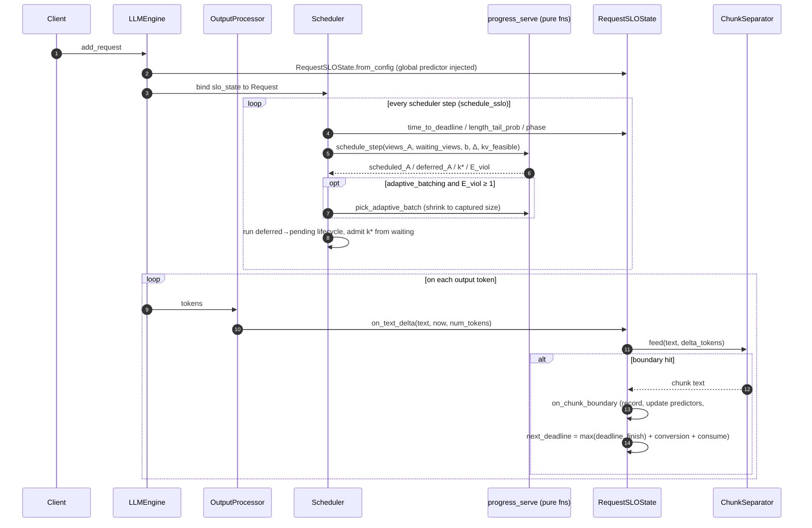

# SSLO — Sentence-level SLO Scheduling

SSLO models each LLM request as a stream of **sentence-** or **paragraph-level
chunks** ("consumable units") and assigns a wall-clock deadline to every chunk.
The hypothesis: a TTS engine or human reader consumes generated text
chunk-by-chunk, so an LLM only needs to produce each chunk **before** the
consumer is ready for it. The slack between "ready to emit" and "consumer
needs it" is what SSLO spends on additional admissions to raise GPU occupancy
without breaking per-request latency contracts.

The enforcement policy is **ProgressServe**: per-request deadline-violation
risks are computed from an empirical posterior over chunk lengths, and the
scheduler admits / defers so that the expected number of chunk-deadline
violations stays below 1 (`E_viol < 1`).

This package is non-invasive: every SSLO insertion in non-`sslo/` modules is
prefixed with a `# SSLO` comment so it can be located with `grep -rn "# SSLO"
vllm/`.

---

## 1. Module Map

| File | Lines | Role |
|---|---|---|
| [`config.py`](config.py) | ~150 | `SsloConfig` dataclass — every algorithm tuning knob |
| [`progress_serve.py`](progress_serve.py) | ~265 | ProgressServe math — pure functions, no engine imports, unit-testable |
| [`slo_state.py`](slo_state.py) | ~1050 | Per-request state machine, chunk lifecycle, predictors, separators |
| [`__init__.py`](__init__.py) | 24 | Public re-exports |

Public symbols (from `__init__.py`):
`SsloConfig`, `RequestSLOState`, `Phase`, `ChunkRecord`, `ChunkSeparator`,
`ChunkConsumeEstimator`, `ChunkStatCollector`, `SsloRequestStats`.

---

## 2. Algorithm Overview

| Term | Meaning |
|---|---|
| **chunk** | Sentence (`. ! ? …` + whitespace, or newline) or paragraph (`\n\n`) boundary, with a `min_chunk_tokens` floor that merges short fragments like `"Yes."` |
| **deadline** | Wall-clock time by which chunk N must be generated for the consumer not to stall |
| **phase** | `PREFILL` → `WARMUP` (no chunk done yet) → `MEASURED` (≥ 1 chunk done) |
| **c_q** | Tokens already generated in the current chunk |
| **T_q** | Time remaining to the current chunk's deadline |
| **Δ** | Per-iteration latency estimate (hybrid: profiled Δ(b) shape × live wall-step EMA) |
| **R_run / R_defer** | Chunk-deadline violation risk if the request runs / is deferred this epoch — posterior tail probabilities `P(L > c_q + N | L > c_q)` |
| **M** | Marginal service benefit `R_defer − R_run` (forced to 1 when deferring is a certain miss) |
| **E_viol** | Expected violation count of a schedule; operating rule `E_viol < 1` |

The `method` knob selects whether SSLO is **observed only** (`"baseline"` —
`schedule_sslo()` still runs, chunk records / scheduler stats are emitted for
fair comparison, but placement is vanilla vLLM) or **enforced**
(`"progress_serve"`).

---

## 3. Control Flow



In the in-process engine the scheduler `Request` and the `OutputProcessor`
`RequestState` share the **same** `RequestSLOState` object; in the
multi-process engine, text deltas travel to the scheduler via
`send_slo_updates` IPC and scheduler-side scalars return in
`SsloSchedulerSnapshot`.

---

## 4. ProgressServe Math (`progress_serve.py`)

For each measurable request (MEASURED phase + finite deadline):

```text
H_q     = max(0, floor(T_q / Δ))                      # deadline horizon (iterations)
s       = min(1, B / |A⁺|)                            # service-share approximation
N_run   = 1[H_q ≥ 1] + floor(max(H_q−1, 0) · s)       # feasible tokens if run now
N_defer =              floor(max(H_q−1, 0) · s)       # feasible tokens if deferred
R_run   = P(L > c_q + N_run  | L > c_q)               # empirical tail posterior
R_defer = P(L > c_q + N_defer | L > c_q)
M       = R_defer − R_run   (forced to 1 if R_defer ≥ 1, to avoid abandonment)
```

- **`build_plan(A, A_new, b, Δ)`** — forced requests (PREFILL / WARMUP / no
  deadline) always take a slot and are excluded from `E_viol`; remaining decode
  slots go to measurable requests by largest `M`; the rest are deferred.
  `E_viol = Σ_scheduled R_run + Σ_deferred R_defer`.
- **`schedule_step(...)`** — scans the FCFS waiting prefix upward for
  `k* = max{k : E_viol(k) < 1}` (E_viol is monotone in k), hard-capped by a
  `kv_feasible(k)` callback (free-KV-block based).
- **`pick_adaptive_batch(...)`** — only when `E_viol(base_b) ≥ 1`: hill-climbs
  down through CUDA-graph-captured batch sizes (smaller b → smaller Δ → larger
  H_q for the urgent few, at the cost of deferring the slack-rich rest), stops
  when E_viol rises. Cannot shrink below the forced-request count.

The posterior tail comes from the **shared global chunk-length history**
(`length_tail_prob` in `slo_state.py`); before
`global_warmup_predictor_samples` samples accumulate (or when fewer than
`progress_serve_min_denom` history samples exceed `c_q`), an analytic
cold-start tail bounded by `cold_start_max_remaining_tokens` is used.

---

## 5. Per-Request State (`slo_state.py`)

`RequestSLOState` key fields: `decoding_start_ts`, `next_deadline_ts`,
`current_chunk_generated_len`, `chunks_completed`, `admitted_ts`,
`terminal_outcome`, pending-interval accounting, and
`chunk_stats: ChunkStatCollector`.

Key methods:

| Method | Purpose |
|---|---|
| `time_to_deadline(now)` | `T_q` minus a 1.2× guard on the predicted TTS conversion time |
| `expected_remaining_len()` | Diagnostic point estimate: per-req predictor with global warmup fallback, p90→p95→p99 escalation ladder + overshoot factor |
| `length_tail_prob(x)` | ProgressServe posterior `P(L > x \| L > c_q)` from the global empirical history, with cold-start fallback |
| `mark_admitted(now)` | Idempotent waiting→running first-admit timestamp |
| `on_chunk_boundary(...)` | Record chunk, update per-req + global predictors, advance deadline |
| `on_pending_enter/exit(now)` | Open / close a deferred (pending) interval |
| `on_step(decoding_only)` | Per-scheduler-step running/pending tallies |
| `on_text_delta(...)` | Hot path: feed streamed text to the separator |
| `on_finish(now)` / `compute_stats()` | Flush remainder, produce `SsloRequestStats` |

### Deadline recurrence

At every chunk boundary:

```text
next_deadline_ts = max(next_deadline_ts, gen_finish_ts) + conversion_time + chunk_consume_time
```

An early chunk does **not** bank extra slack. A late chunk re-anchors the
deadline at the finish moment, so a single stall does not propagate as a
permanent debt. In `read` mode conversion_time is 0; in `tts` mode it comes
from the profile (`TtsProfileConsumeEstimator`) and chunk 0's deadline also
waits for first-audio readiness.

### Chunk-length predictor

`ChunkLengthPredictor` strategies (`chunk_len_strategy`): `ema`, `p90`, `p99`
(sliding-window percentiles over up to `chunk_len_predictor_history_max`
samples), `past-future` (placeholder). ProgressServe requires a
history-keeping strategy since the posterior tail reads the empirical history.

The diagnostic point estimate `expected_remaining_len()` is **warmup-gated
hybrid**: it uses the scheduler-owned global predictor until the per-request
sample count reaches `num_warmup_chunks`, then trusts the request's own
pattern. With `p90` it escalates p90 → p95 → p99 once the current chunk
reaches `mlp_predictor_escalate_threshold ×` the tier value, and beyond p99
predicts `(c_q − top_tier) × mlp_predictor_overshoot_safety_factor`.

### Chunk separation

`ChunkSeparator.feed()` accumulates streamed deltas and yields completed
chunks at sentence (punctuation + whitespace, or newline) or paragraph
boundaries. Chunks shorter than `min_chunk_tokens` are merged into the next
chunk. Handles markdown tables, list bullets, CJK/Thai punctuation, and
degenerate repetition.

---

## 6. Scheduler Integration (`vllm/v1/core/sched/scheduler.py`)

- `schedule_sslo()` replaces vanilla `schedule()` when SSLO is enabled;
  dispatches by `method` (`_apply_sslo_baseline` / `_apply_sslo_progress_serve`).
- Δ estimation is **hybrid**: the worker profiles per-batch-size decode forward
  latency Δ(b) during CUDA-graph capture (`gpu_model_runner.py`), and the
  scheduler rescales that shape with a live wall-step EMA keyed by
  (batch, prefills).
- Deferred requests move to an `sslo_pending` pool (KV retained on GPU) and
  fire `on_pending_enter/exit` lifecycle hooks.
- Logging: per-step `scheduler_stats.jsonl` (via `SSLO_STATS_LOG_PATH`) and
  `decisions.jsonl` (`decision_log_mode`); `reset_sslo_state()` clears global
  predictor + logs between rate-sweep cells.

---

## 7. Configuration Reference (`SsloConfig`)

Defaults shown; validation in `__post_init__`.

### Scheduling mode

| Field | Default | Meaning |
|---|---|---|
| `method` | `"baseline"` | `"baseline"` = metrics only · `"progress_serve"` = enforce |
| `adaptive_batching` | `False` | Allow decode-batch shrink when `E_viol ≥ 1` |
| `kv_blocks_per_new_admit` | 8 | Admission cap = `free_kv_blocks // N`; 0 disables |

### KV offload tier (see §9)

Only valid under `method == "progress_serve"`.

| Field | Default | Meaning |
|---|---|---|
| `kv_offload` | `False` | Enable the KV offload tier (vacate deep-slack deferred KV to CPU, prefetch before deadline). Requires the `SimpleCPUOffloadConnector` |
| `kv_onload_lead_iters` | 2 | Restore a CPU-resident request this many decode iters before its horizon: `N_defer_cpu = floor(max(H_q − 1 − lead, 0) · s)` |
| `kv_offload_risk_eps` | 1e-3 | Risk-penalty threshold separating vacate (`M_cpu ≤ eps`) from promote (`M_cpu > eps`) candidates |
| `kv_offload_min_residency_steps` | 0 | Anti-thrash: min scheduler steps a request stays resident after onload before it may re-vacate; 0 disables |

### Chunking & consumption

| Field | Default | Meaning |
|---|---|---|
| `chunk_unit` | `"sentence"` | `"sentence"` or `"paragraph"` boundaries |
| `min_chunk_tokens` | 16 | Merge chunks below this size into the next chunk |
| `seconds_per_word` | 0.28 | Fixed consume rate (`read` mode) |
| `consume_mode` | `"read"` | `"read"` or `"tts"` (needs `tts_profile_path` + `tts_model`) |
| `tts_profile_path` | `None` | CSV from `exp/measure_tts_duration` (word_count → duration stats) |
| `tts_model` | `None` | Row selector within the TTS profile |

### Predictor / posterior

| Field | Default | Meaning |
|---|---|---|
| `chunk_len_strategy` | `"p90"` | `ema` / `p90` / `p99` / `past-future` |
| `num_warmup_chunks` | 16 | Per-req samples before the global predictor is dropped (diagnostic estimate) |
| `chunk_len_predictor_history_max` | 4096 | Max percentile-history samples per predictor |
| `global_warmup_predictor_samples` | 128 | Global samples before the empirical posterior is trusted |
| `cold_start_max_remaining_tokens` | 2048 | Bound of the analytic cold-start tail |
| `progress_serve_min_denom` | 4 | Min history samples above `c_q` to trust the empirical tail |
| `mlp_predictor_escalate_threshold` | 0.9 | p90 → p95 → p99 escalation trigger |
| `mlp_predictor_overshoot_safety_factor` | 3.5 | Post-p99 overshoot factor |

### Timing & diagnostics

| Field | Default | Meaning |
|---|---|---|
| `tpot_ema_alpha` | 0.1 | EMA smoothing of the per-batch wall-step time (Δ source) |
| `decision_log_mode` | `"tier_changes"` | `off` / `step` / `tier_changes` / `admit_only` |
| `decision_heartbeat_steps` | 200 | Heartbeat cadence for `tier_changes` mode |

---

## 8. Output Contract

Every completed chunk is captured as a `ChunkRecord` and accumulated in
`ChunkStatCollector`:

- **Time**: `start_time_ts`, `gen_finish_ts`, `deadline_ts`, `slack_s`,
  stall window, `chunk_consume_time_s`, conversion time
- **Tokens**: `num_token`, `token_start_idx`, `token_end_idx`,
  `cumulative_tokens_at_end`
- **Predictor**: `expected_len`, `predictor_source`
- **Scheduler**: `num_iters`, `num_running_iters`, `num_pending_iters`
- **Meta**: `word_count`, `text`

Records flow out as `RequestOutput.slo_chunk_records` (plus per-request
aggregates in `RequestOutput.sslo_metrics` from `SsloRequestStats`), are
dumped to `chunks.jsonl` / `requests.jsonl` by `exp/run_sslo/run_test.py`, and
aggregated by `exp/run_sslo/analyze.py`.

---

## 9. KV Offload Tier (`kv_offload`)

**Motivation.** In the KV-capped regime the admission cap
(`free_kv_blocks // kv_blocks_per_new_admit`) — not the decode-batch width — is
what throttles admission. Deep-slack **deferred** requests still occupy GPU KV
blocks they will not consume for many iterations. Vacating that KV to CPU frees
admission headroom so newly-arriving urgent requests can be admitted sooner,
then prefetching it back before the deferred request's deadline keeps its own
SLO intact.

**Three-state math (`progress_serve.py`).** Each measurable deferred request is
in one of three KV locations:

- `LOC_GPU` — resident, contributes `R_defer` to `E_viol`.
- `LOC_CPU` — vacated, holds no decode slot; contributes `R_defer_cpu` to
  `E_viol` but is out of the service race (`|A+|` excludes it).
- `LOC_ONLOADING` — promoted CPU→GPU, slot reserved for the restore. Behaves
  like a forced/new admit: it occupies a slot in `|A+|` and is excluded from
  `E_viol`.

The CPU-side risk uses a lead-shortened future-service estimate
`N_defer_cpu = floor(max(H_q − 1 − lead, 0) · s)` (a CPU-resident request must be
onloaded `kv_onload_lead_iters` before its horizon, losing `lead` usable iters).
Because `N_defer_cpu ≤ N_defer` and the length tail is non-increasing,
`R_defer_cpu ≥ R_defer`, so the CPU-stay penalty
`M_cpu = R_defer_cpu − R_defer ≥ 0`. The admission budget becomes
`E_viol = Σ_{deferred GPU} R_defer + Σ_{CPU measurable} R_defer_cpu`.
`kv_offload_risk_eps` splits candidates: `M_cpu ≤ eps` → the CPU stay is cheap
→ **vacate** candidate; once the lead penalty surfaces (`M_cpu > eps`) →
**promote** candidate.

**Mechanism.** The scheduler mirrors KV eagerly through
`SimpleCPUOffloadConnector` (a CPU copy of every block always exists), so a
**vacate** is ~free — it just frees the GPU blocks. A **promote** reuses vLLM's
asynchronous `WAITING_FOR_REMOTE_KVS` onload path (the same one used for remote
KV transfer), so the CPU→GPU restore is hidden behind ongoing decode.
`kv_offload_min_residency_steps` guards against thrash by pinning a just-onloaded
request resident for a minimum number of steps. Per-step offload counters
(`num_offloaded`, `kv_capped`, `k_star_unconstrained`) land in
`scheduler_stats.jsonl`; per-request lifecycle
(`total_offloaded_time_s` / `num_offload_intervals` / `num_onloads`) rides on
`SsloRequestStats`.

---

## 10. Related

- **Experiment harness**: `exp/run_sslo/` — modes `baseline` /
  `progress_serve` / `progress_serve_adaptive` / `progress_serve_offload`; see
  its README.
- **Unit tests**: `vllm/tests/sslo/` (`test_progress_serve`,
  `test_scheduler_sslo`, `test_slo_state`, `test_sslo_config`,
  `test_tts_consume_path`).
- **KV offload connector**: `vllm/v1/simple_kv_offload/` +
  `SimpleCPUOffloadConnector` (registered in the KV-connector factory) back the
  ProgressServe KV offload tier (§9) — enabled when `kv_offload=True` (the
  `progress_serve_offload` harness mode).
- **Repository convention**: every SSLO insertion in non-`sslo/` modules is
  prefixed with a `# SSLO` line comment. See top-level
  [`AGENTS.md`](../../../AGENTS.md).
